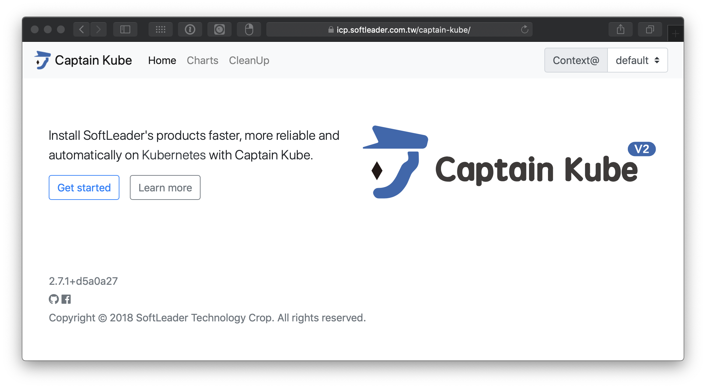

每一家 Kubernetes 實作廠商都有自己的部署工具或 Command line tool, 如 Google Helm 的 `helm`, IMB Cloud Private 的 `bx pr`, Red Hat OpenShift 的 `oc` 等。

松凌科技因此推出了整合的工具, 並提供了的 Web 介面, 配合上松凌科技的產品 DevOps 流程, 提供我們的客戶一個快速, 可靠穩定, 且自動化的部署體驗 - Captain Kube

## Documentation and Other Links:

- [Setup Documentation](https://github.com/softleader/captain-kube/wiki/Installation)
- [Usage Documentation](https://github.com/softleader/captain-kube/wiki)
